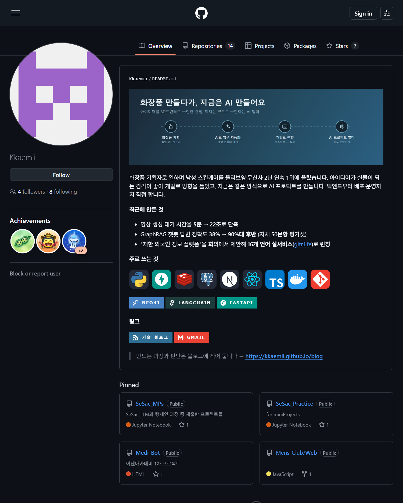

GitHub 프로필을 좀 꾸며보기로 했다. `github.com/아이디`로 들어가면 맨 위에 뜨는 자기소개 카드, 그거 말이다.

만드는 법은 검색하면 다 나온다. 아이디랑 똑같은 이름으로 public 레포를 만들고(나는 `Kkaemii/Kkaemii`), 거기에 `README.md`를 넣으면 프로필에 자동으로 뜬다고. 시키는 대로 다 했다. public 맞고, 이름도 정확하고, README도 기본 브랜치에 멀쩡히 있었고. 그런데 안 떴다.

## 1. 되는 건 다 해봤는데

"곧 뜨겠지" 하고 기다렸는데 20분이 지나도 감감무소식이었다. 그래서 온갖 걸 시도했다.

- 커밋 하나 더 얹어서 다시 push → 그대로
- private로 바꿨다가 다시 public으로 토글 → 그대로
- 이름을 바꿨다가 원래대로 되돌리기(rename 라운드트립) → 그대로
- 아예 레포를 지우고 처음부터 다시 생성 → 그래도 그대로

중간엔 레포 `size`가 계속 `0`으로 찍히길래 "아 GitHub이 이 레포를 제대로 처리 못 하나?" 싶기도 했다. 근데 알고 보니 그냥 갓 만든 작은 레포의 정상값이더라. 엉뚱한 단서였던 거다. GitHub 상태 페이지도 멀쩡했고.

설정은 처음부터 다 맞았는데 프로필에만 안 뜨는 상황. 이쯤 되니 슬슬 답답했다.

## 2. 결국 뜨게 만든 건 버튼이었다

레포 페이지를 다시 천천히 훑다가 버튼 하나를 발견했다. **Share to profile**. 눌렀더니 그 자리에서 바로 떴다.

## 3. 근데 원래 자동이라는데?

한참 뒤에 [GitHub 공식 문서](https://docs.github.com/en/account-and-profile/how-tos/profile-customization/managing-your-profile-readme)를 찾아보고 알았다. 신규 레포는 네 조건(이름=아이디, public, 루트에 `README.md`, 내용 있음)만 맞으면 원래 자동으로 뜬단다. 'Share to profile' 버튼은 2020년 7월 이전에 만든 레포를 위한 거고.

그럼 내 경우는? 자동으로 떴어야 정상인데 무슨 이유에선지 한참을 안 떴던 거다. 커뮤니티를 봐도 "자동이라는데 바로 안 뜬다"는 사람이 꽤 있더라. 결국 'Share to profile'은 안 뜰 때 게시를 수동으로 밀어주는 버튼이었던 셈이다. 그동안 내가 한 push·토글·rename은? 이 버튼과 아무 상관 없는 헛발질이었고.

## 4. 그런데 한 번만 켜면 되는 것 같다

글 쓰면서 버튼을 다시 보고 싶어서 레포를 지우고 똑같이 다시 만들어봤다. 이번엔 버튼을 누르지도 않았는데 바로 떴다.

한 번 게시하고 나면 GitHub이 그 상태를 기억하는 모양이다. 지웠다 다시 만들어도 자동으로 올라온다. 그래서 지금은 그 버튼을 다시 보고 싶어도 못 본다. 누르기 전에 캡처나 해둘걸.

## 5. 다음에 안 헤매려고 남기는 메모

- 프로필 README는 조건만 맞으면 원래 자동으로 뜬다. 안 뜨면? 레포 페이지에서 **"Share to profile"** 버튼부터 찾아본다 (2020년 7월 이전 레포는 이게 필수)
- push·visibility 토글·재생성은 이 경우 아무 소용 없다
- `size: 0`은 새 레포에선 정상. 고장 신호로 오해하지 말 것

한 시간 가까이 엉뚱한 데를 파다가 버튼 하나로 끝났다. 안 되는 이유를 코드에서만 찾으려던 게 실수였다. 가끔은 답이 그냥 화면에 떠 있다.
