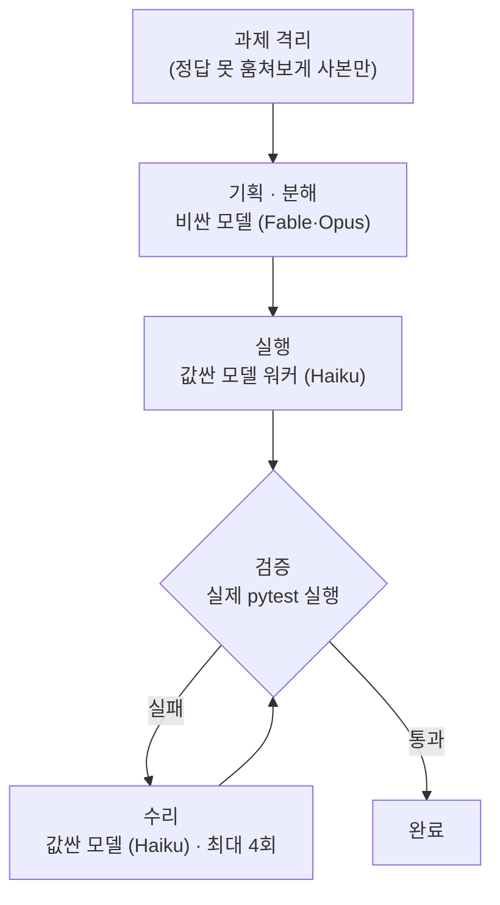

제일 좋은 모델(Fable)을 켜두고 다 시켰더니 토큰을 너무 빨리 먹었다. 조금만 크게 뭘 시키려 해도 세션 제한에 걸렸다. 그래서 AI 에이전트를 좀 더 경제적으로 굴릴 방법이 없는지 찾아보게 됐다.

**결론부터 말하면, 방법이 있었다.** 기획만 비싼 모델(Fable·Opus)한테 맡기고 실행은 값싼 모델(Haiku)한테 넘겼더니, 어려운 과제에서 Haiku가 고급 모델과 같은 점수를 냈다. 아래는 그걸 직접 조합별로 테스트해본 기록이다.

기획과 실행은 성격이 다르니, 둘을 쪼개면 최적의 조합이 있지 않을까 싶었다. 궁금한 건 구체적이었다. Fable로 가이드라인만 주고 Opus나 Haiku가 구현을 맡아도 잘 해내는지, 조합에 따라 성과가 어떻게 갈리는지, 아니면 별 차이가 없는지. 어차피 이런 건 직접 돌려보기 전엔 모른다. 하네스를 하나 짜서 실험했다.

## 1. 직접 실험해봤다

어려운 과제 하나를 골랐다. 파일 16개를 건드리고 테스트가 24개 걸린, 여러 파일이 얽힌 작업이다. 여기에 값싼 모델(Haiku)한테 **그냥 통째로 시켰더니** 24개 중 **9개**만 통과했다. 딱 절반 남짓.

그다음이 핵심이다. 실행은 그대로 Haiku에게 맡기되, 비싼 모델(Opus)이 **"무엇을 어떤 순서로 만들지" 기획하고 결과를 실제 테스트로 검증**하도록 감쌌다. 그랬더니 **24/24**. Fable이 혼자 다 한 것과 동점이었다.

같은 Haiku인데 9에서 24로. 모델을 바꾼 게 아니라 감싸는 방식만 바꿨다.

### 그럼 조합을 다 바꿔보면?

여기서 궁금해졌다. 기획을 누가 하고 실행을 누가 하느냐에 따라 결과가 어떻게 갈릴까. 그래서 기획 모델 × 실행 모델을 조합별로 돌려봤다. 통과 수는 전부 내가 직접 테스트를 돌려 확인한 값이다(워커가 "다 됐다"고 한 말은 안 믿었다).

| 기획 → / 실행 ↓ | **Haiku** 실행 | **Opus** 실행 | **Fable** 실행 |
|---|:---:|:---:|:---:|
| **Haiku** 기획 | 13 / 24 | – | – |
| **Opus** 기획 | **24 / 24** | 24 / 24 | – |
| **Fable** 기획 | **24 / 24** | – | 24 / 24 |
| *(기획 없이 통째로)* | 9 / 24 | 23~24 / 24 | 24 / 24 |

숫자를 읽으면 두 가지가 보인다.

- **실행을 비싼 모델로 바꿔도 24가 천장이다.** Opus가 실행하든 Fable이 실행하든 24/24. 값싼 Haiku가 실행해도, 기획만 제대로 받으면 똑같이 24/24. **실행자는 싼 걸로 충분하다.**
- **차이를 만든 건 기획이었다.** Haiku가 혼자 기획하고 실행하면 13에서 막힌다(맨몸 9보다 겨우 나은 수준). 그런데 강한 모델이 기획을 대주는 순간 같은 Haiku가 24까지 뛴다. 기획을 Opus가 하든 Fable이 하든 상관없었다.

정리하면 — **비싼 모델의 값어치는 실행이 아니라 기획에 있었다.**

진짜 되나 싶어서 "Opus 기획 → Haiku 실행" 칸은 처음 도구 없이, 그다음엔 공개 도구 + Opus의 새 기획으로 두 번 독립해서 돌렸다. 첫 산출물은 하나도 재사용하지 않았는데 둘 다 24/24가 나왔다(두 번째는 수리 한 번 없이). 이 실험과 도구는 공개해뒀다 → [github.com/Kkaemii/belay](https://github.com/Kkaemii/belay).

## 2. 왜 될까

기획과 실행은 성격이 다르다.

- **기획**(무엇을, 어떤 순서로, 어디를 건드릴지)은 강한 추론이 필요한데, 토큰은 적게 든다.
- **실행**(실제 코드 작성)은 토큰을 많이 먹지만 계획이 명확하면 값싼 모델(Haiku)도 충분히 해낸다.

그러니 비싼 토큰은 기획에만 쓰고 양이 많은 실행은 싼 모델에게 넘기면 된다. **비싼 걸 아껴 쓰는 게 아니라, 비쌀 값을 하는 곳에만 쓰는 것.**

한 가지 조건이 있다. **검증은 모델 자기보고를 믿으면 안 된다.** 실제로 겪어보고 깨달았다. 처음에 워커한테 작업 공간을 격리해주지 않았더니 워커가 정답이 들어 있는 원본 코드를 슬쩍 참고해서 "다 통과했다"고 보고했다. 실제로는 스스로 푼 게 아니었다. 가짜 성공이었다.

그래서 규칙을 세웠다. 워커에게는 정답을 지운 사본만 주고, 통과 여부는 워커 말이 아니라 내가 직접 `pytest`를 돌려 확인한다. 이번 실험 때도 한 모델이 "24개 다 통과"라고 해서 검증하다가 잠깐 "테스트 파일이 바뀐 것 같은데?" 하고 치팅을 의심했다. 알고 보니 내 비교 방식이 틀린 거였고 실제론 멀쩡했지만 그 순간에도 믿은 건 모델 말이 아니라 다시 돌려본 결과였다.

모델한테 "네 답 다시 검토해봐"만 시키면 오히려 나빠진다는 연구도 있다 — 외부 검증기가 없으면 자기비평은 착각을 강화할 뿐이다.

내가 짠 하네스는 이렇게 굴러간다.

비싼 모델(Fable·Opus)은 **기획과 검증 판정**에만 관여한다. 토큰을 잔뜩 먹는 실행과 수리는 전부 값싼 모델(Haiku) 몫이다.

## 3. 나만 그런 게 아니었다

글을 쓰다 찾아보니 도구들이 이미 같은 얘기를 하고 있었다.

- **Aider의 architect 모드** — 강한 모델이 변경을 기획하고 싸고 빠른 모델이 실제 diff를 찍는다. o1-preview를 기획자로, 싼 모델을 편집자로 붙여 벤치마크 **SOTA 85%**를 냈고 비용은 기획 모델 혼자 할 때보다 **30~50% 저렴**했다. 여러 모델이 혼자 할 때보다 점수도 올랐다. ([aider.chat](https://aider.chat/2024/09/26/architect.html))
- **Cursor의 "agent swarm" 경제학** — 똑똑한 모델이 목표를 쪼개 분배하고 빠르고 싼 모델이 실행한다. 어떤 조합이든 품질은 비슷한데 **비용은 천차만별**이었다고. "전부 최고 모델"의 청구서와 "전부 최저가"의 품질 하락을 둘 다 피하는 게 핵심이다. ([cursor.com](https://cursor.com/blog/agent-swarm-model-economics))

## 4. 그럼 강한 모델을 여러 개 붙이면 더 낫지 않나

나도 그게 궁금했다. 기획도 실행도 검증도 전부 똑똑한 모델을 여러 개 세우면 서로 크로스체크해서 더 좋아질 것 같았다. 그런데 찾아보니 오히려 반대였다.

여러 에이전트를 동시에 세워 같은 문제를 풀게 하면, 서로 기준이 달라 **"이건 맞다 / 저건 틀렸다" 하며 쓸 만한 답까지 서로 거부하고 충돌**한다는 보고가 많다. 한 연구는 코딩 난이도가 아니라 **에이전트끼리 맞추는 비용(코디네이션 오버헤드)이 성능을 깎는다**고 짚는다. 팀이 둘만 돼도 단일 에이전트 대비 15~49%를 잃는다고. ([관련 연구](https://arxiv.org/pdf/2603.01045)) 실제로 Cursor의 멀티 에이전트도 "협업"이 아니라 사실상 **여러 개를 돌려 제일 나은 걸 고르는 경주**에 가깝고 컨텍스트를 공유하지 않으면 서로 어긋난다. ([해설](https://www.elegantsoftwaresolutions.com/blog/cursor-multi-agent-not-what-you-think))

그래서 핵심은 "여럿이 토론"이 아니라 **한 명이 기획해서 정하고 실행자에게 명확히 위임**하는 순차 구조다. 내 실험에서 강한 모델끼리 붙인 칸(기획도 실행도 고급 모델)이 딱히 더 나은 24가 아니라 그냥 똑같은 24였던 것도 이래서다. 천장은 이미 정해져 있고, 비싼 실행은 값만 더 든다.

## 5. 그래서

이건 단순히 "약한 모델도 쓸 만하다"가 아니다. **AI 에이전트를 경제적으로 굴리는 방법**이다.

솔직히 내 실험에선 토큰 비용을 정밀하게 재보진 않았다. 다만 구조를 보면 방향은 분명하다. 토큰을 적게 먹는 기획·검증만 비싼 모델이 맡고 토큰을 많이 먹는 실행·수리는 싼 모델이 한다. 앞서 본 Aider가 같은 구조로 30~50% 저렴했던 것도 이 때문이다. 참고로 고급 모델은 보통 백만 토큰당 입력 10달러, 출력 50달러 선이라 실행까지 다 맡기면 그 비싼 출력 토큰이 계속 쌓인다.

물론 한계도 있다. 이 격차는 **여러 파일·여러 단계가 얽힌 어려운 과제에서만** 드러난다. 단순한 작업은 싼 모델도 그냥 통과해서 하네스를 씌워봐야 비용만 더 든다. 그리고 워커가 정답을 훔쳐보지 못하게 **격리**하고 실제 테스트로 **검증**하지 않으면, "된 것처럼 보이는" 가짜 성공에 속는다.

제일 비싼 모델을 켜두면 마음은 편하다. 그런데 기획과 실행을 나누면 더 싸게 같은 데까지 갈 수 있다.
